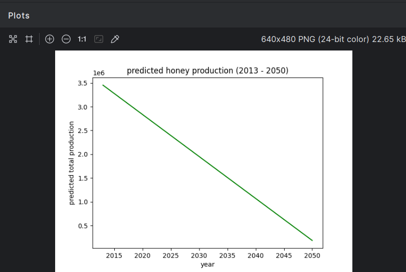
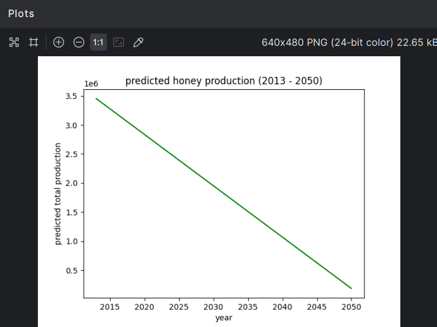
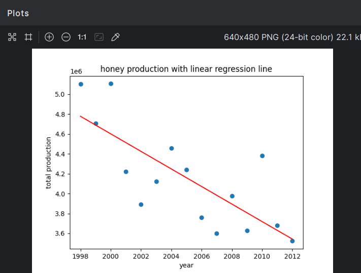

## Honey Production Decline: Linear Regression Project

This project dives into honey production trends in the US and explores how the decline in honeybee populations may impact future honey production. Using real-world data from Kaggle, we apply a linear regression model to analyze honey production over the years and predict future trends.

### What's Inside:
- **Data**: The dataset used contains various stats like honey production, stock, prices, and production values across US states from 1998 to 2013.
- **Analysis**: We group the data by year, visualize it with scatter plots, and fit a linear regression model to understand the relationship between years and honey production.
- **Predictions**: Using the model, we predict future honey production trends all the way to 2050, based on historical data.
- **Visualization**: The project includes several plots to visualize both historical honey production and future predictions.

### Tools Used:
- Python
- Pandas & NumPy for data manipulation
- Matplotlib for visualizations
- Scikit-learn for building and fitting the regression model

### How to Run:
1. Clone the repo.
2. Make sure you have all the necessary Python libraries installed (`pandas`, `numpy`, `matplotlib`, `scikit-learn`).
3. Run `main.py` to see the analysis and predictions.

### Dataset:
The dataset (`honeyproduction.csv`) should be placed in the root folder. It contains the following columns:
- **state**: US state
- **numcol**: Number of honey-producing colonies
- **yieldpercol**: Honey yield per colony
- **totalprod**: Total honey production
- **stocks**: Stocks of honey held
- **priceperlb**: Price of honey per pound
- **prodvalue**: Value of production
- **year**: Year of observation

### Plots:

